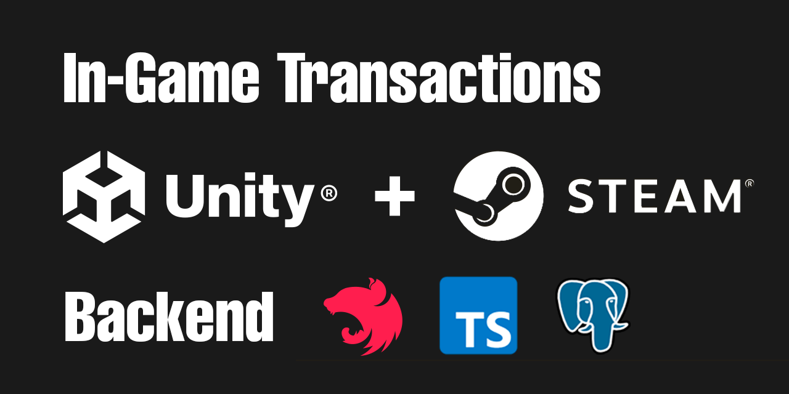
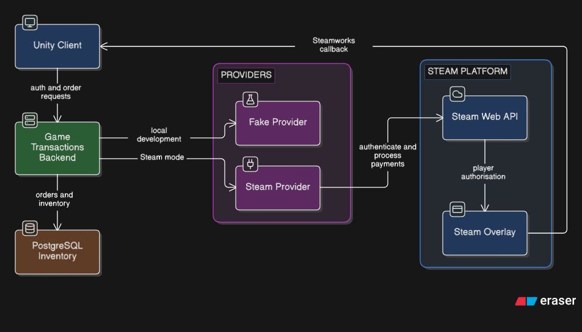

# Game Transactions Backend

A reusable starting point for a Unity game's Steam-authenticated catalogue, microtransactions, and inventory. It lets a project use fake authentication and payments during development, then switch to Steam without changing the API Unity calls.

## How it works

```text
Unity + Steamworks SDK  →  NestJS backend  →  Steam Web API
                                  ↓
                             PostgreSQL
```

1. Unity obtains a Steam session ticket through Steamworks and sends it to the backend.
2. Unity requests a product order when the player presses **Buy**.
3. The backend creates the order and starts the Steam transaction using its server-only credentials.
4. Steamworks notifies Unity when the player authorises the purchase in the Steam overlay.
5. Unity asks the backend to confirm that order. The backend verifies it with Steam, then grants the item exactly once.

Unity never receives Steam publisher credentials, chooses prices, or marks orders as paid.

## Repository layout

- [`backend`](./backend): NestJS API, PostgreSQL schema and migrations, fake and Steam providers, Docker setup, and automated tests.
- [`unity-client`](./unity-client): Unity-side integration code.

## Using this for a real game

Fork this repository before adding game-specific products, Steamworks credentials, domains, or hosting. Give every fork its own database, secrets, product catalogue, and Steam App ID. Develop with the fake providers first; when the Steam Sandbox integration is ready, enable the Steam providers in that fork's environment configuration.

## Technical documentation

The backend has its own, more detailed guide: [backend/README.md](./backend/README.md). It explains local setup, Docker, environment variables, API endpoints, the Unity/Steam purchase flow, provider configuration, migrations, deployment considerations, and tests.

